# singe page aplication
##### browser-terminal-Editor(vscode-subline-atom-webstrorm)-server
####  js - CDN Links - babel
```jsx
index.html
sudo npm i -g live-server
liver-servr =>127.0.0.1:8080
// 1.
<!DOCTYPE html>
<html lang="en">
<head>
  <meta charset="UTF-8">
  <meta http-equiv="X-UA-Compatible" content="IE=edge">
  <meta name="viewport" content="width=device-width, initial-scale=1.0">
  <title>React</title>
</head>
<body>
  <div id="app">
    this is palin html
  </div>
  <script>
    document.getElementById("app").innerHTML ="learning react"
  </script>
  
</body>
</html>

//CDN Links
//2.https://reactjs.org/docs/cdn-links.html
<!DOCTYPE html>
<html lang="en">
<head>
  <meta charset="UTF-8">
  <meta http-equiv="X-UA-Compatible" content="IE=edge">
  <meta name="viewport" content="width=device-width, initial-scale=1.0">
  <title>React</title>
  <script crossorigin src="https://unpkg.com/react@18/umd/react.development.js"></script>
  <script crossorigin src="https://unpkg.com/react-dom@18/umd/react-dom.development.js"></script>

</head>
<body>
  <div id="app">
    this is html
  </div>
  <script>
<!--  1  -->
<!--     document.getElementById("app").innerHTML ="react" -->
<!--  3  -->
    const divElement = React.createElement('div',{},'learning react')
    ReactDOM.render(
<!--  2    -->
<!--       React.createElement('div',{},'react1'), -->
      divElement,
      document.getElementById("app")
    )
  </script>
  
</body>
</html>
// 3.
//babel
//Quickly Try JSX
// https://reactjs.org/docs/add-react-to-a-website.html
<!DOCTYPE html>
<html lang="en">
<head>
  <meta charset="UTF-8">
  <meta http-equiv="X-UA-Compatible" content="IE=edge">
  <meta name="viewport" content="width=device-width, initial-scale=1.0">
  <title>React</title>
  <script crossorigin src="https://unpkg.com/react@18/umd/react.development.js"></script>
  <script crossorigin src="https://unpkg.com/react-dom@18/umd/react-dom.development.js"></script>
  <!-- babel -->
  <script src="https://unpkg.com/babel-standalone@6/babel.min.js"></script>


</head>
<body>
  <div id="app">
    this is html
  </div>
  <script type="text/babel">    
    
    ReactDOM.render(
    <div>this is JSX</div>,
      document.getElementById("app")
    )
  </script>
  
</body>
</html>
```
```jsx
//index.html
<!DOCTYPE html>
<html lang="en">
<head>  
  <title>React</title>
  <script crossorigin src="https://unpkg.com/react@18/umd/react.development.js"></script>
  <script crossorigin src="https://unpkg.com/react-dom@18/umd/react-dom.development.js"></script>
  <!-- babel -->
  <script src="https://unpkg.com/babel-standalone@6/babel.min.js"></script>
</head>

<body>
  <div id="app">
    this is html
  </div>
 
  <script type="text/jsx" src="./app.js"></script>   
</body>
</html>

```
```jsx
//jsx : A library that allows us to have HTML-like code in JavaScript
//app.js
const Button = () => ( <button>Click here!</button>)
const App = (
  <div>    
    <h1>learning react</h1>
    <p>lorem</p>
    <Button/>
  </div>
  
)

ReactDOM.render(App,document.getElementById("app"))  
```
```jsx
live-server
http://127.0.0.1:8080
out=>
learning react
lorem
click here
```

## vscode Editor

## How to select multiple lines in VS code

[vscode](https://codesource.io/how-to-select-multiple-lines-in-vs-code/)

- For Desktop : Ctrl + Alt + Arrow Keys (Up/Down),Alt+cursor(click) ,Ctrl + D
- For Mac : Opt + Cmd + Arrow Keys (Up/Down)
- For Linux: Shift + Alt + Arrow Keys (Up/Down),Alt+cursor(click) ,Ctrl + D

## install extension

## SimpleRecatSnippet

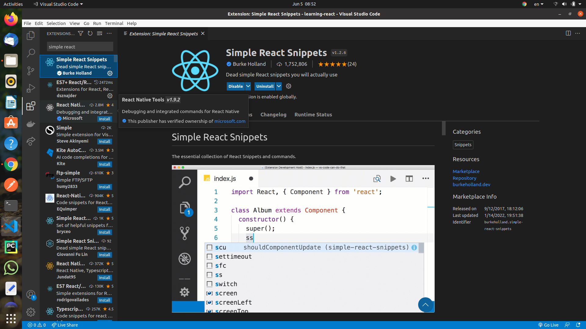
cc = > class<br>
rfce or sfc= > function<br>
rfc => exort function

## Prettier

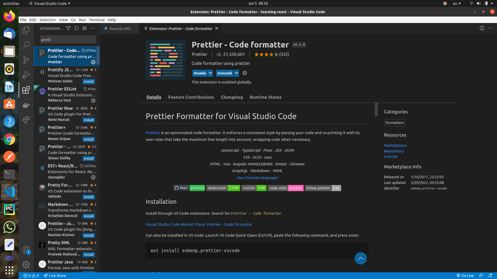

## Format

1.file/preferences/settings<br>
2.settings.json<br>
add this line ("editor.formatOnSave":true,) to file<br>
"editor.formatOnsave":true,<br>
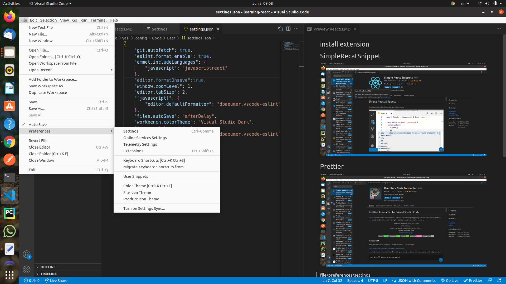

3.file/autosave (active)

## install nodejs

install nodejs (LTS version) because npm

[nodejs](https://nodejs.org/en/)

```
node -v
npm -v
```

## How do I update Node.js?

```jsx
1.clear NPM's cache
sudo npm cache clean -f
2.Install a little helper called 'n'
sudo npm install -g n
3.Install latest stable Node.js version
sudo n stable

node -v
npm -v
```

## install react

```

sudo npm i -g create-react-app
create-react-app hello-word
cd hello-word
npm start
```

local server,webpack(budel js),babel

## The main structure of the project

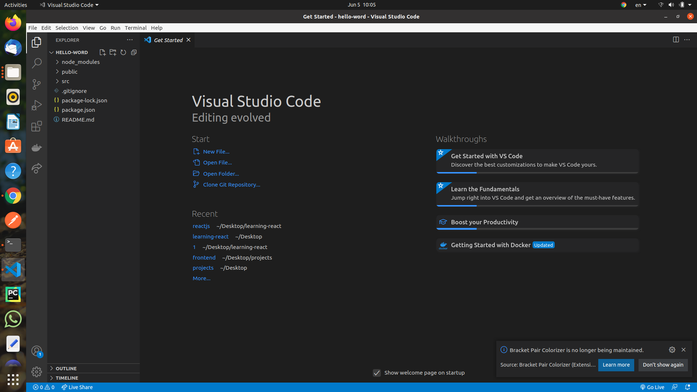

## babel

[babel](https://babeljs.io)
tryitout tab

```jsx
const element = <h1> hello </h1>
out=>
const element = /*#__PURE__*/React.createElement("h1", null, " hello ");

```

## structure project

```jsx

1.public/index.html

<div id="root"></div>

## Virtual Dom

2.src/index.js

import ReactDOM from 'react-dom';

ReactDOM.render(
  <App />,
  document.getElementById('root')
);


3.src/App.js


```

## start

1.Remove src<br>
2.Create src folder and index.js file<br>
src/index.js

```jsx
import React from "react";
import ReactDOM from "react-dom";

const element = <h1>hello world</h1>;
ReactDOM.render(element, document.getElementById("root"));
```

### jsx to reactelement

```jsx
// jsx to reactelement
// const element = <h1>hello world</h1>
const element = React.createElement("h1", null, " hello world ");
```

out => ctrl + ` (terminal vs code)

```jsx
npm start
```

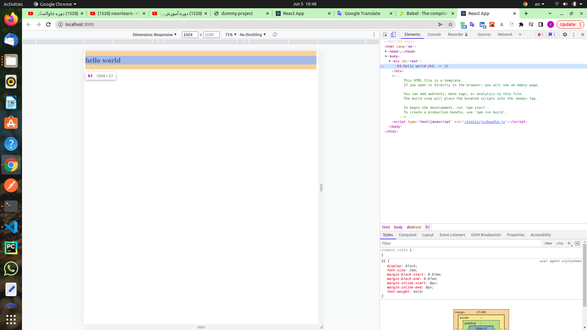

```jsx
<div id="root">
  <h1>hello world</h1>
</div>
```

## Component

- class component
- function component

---

### classComponent
### class
* atribute
* method => render() => return jsx or create ReactElement
```jsx
src / app.js;

import { Component } from "react";
// App (Pascal)
class App extends Component {
  render() {
    return <h1>hello</h1>;
  }
}
```

## point

```jsx
return: Returns only one tag

return <h1>hello class!</h1><h2>trying...</h2>

Failed to compile.

Error in ./src/app.js
Syntax error: Adjacent JSX elements must be wrapped in an enclosing tag (6:32)

```

## solution

```jsx
  return
    (
      <div>
        <h1>hello class!</h1>
        <h2>hello ...!</h2>
      </div>
)
or
<></>
```

## function component

```jsx
src / app.jsx;
function App() {
  return (
    <div>
      <h1>hello function</h1>
    </div>
  );
}
export default App;
```

# export function and export default function

## index.js and person.js

### point

- export default function Used only once

## export function and export default function for importing

- export function walk =>import { walk } <br>
- export default function talk => import talk ';

```jsx
#test
src/index.js
console.log('test')

create person.js => export and export default
export function walk (){

  console.log('walking....')

}

export default function talk (){

  console.log('talking....')

}


src/index.js => import

import talk,{ walk } from './person';
walk()
talk()

```

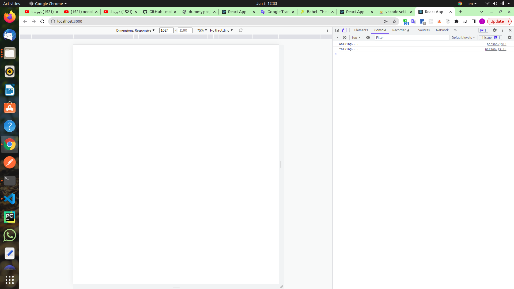

## bootstarp

```jsx
npm i bootstrap

index.js
import 'bootstrap/dist/css/bootstrap.min.css';
```

## class Components

src/components/product.jsx

```jsx
import React, { Component } from "react";

class Product0 extends Component {
  render() {
    return (
      <div>
        <span className="m-2 text-info">product0 name</span>
        <span className="m-2 badge bg-primary">2</span>
        <button className="m-2 btn btn-sm btn-success">+</button>
        <button className="m-2 btn btn-sm btn-warning">-</button>
        <button className="m-2 btn btn-sm btn-danger">delete</button>
      </div>
    );
  }
}

export default Product0;
```

## jsx

- class(keyword on javacripts) to className
- Variable inside bracket {} {2+2}
- We can not use the conditional expression except inside the function

## map

## 1.list element

```jsx
const list = [
      <li>item one</li>,
      <li>item two</li>,
      <li>item three</li>,
      <li>item four</li>
      ]
<ul>
{list}
</ul>
```

## 2. map(text list)

```jsx
const list1 = ['item one','item two','item three'];

<ul>
  {list1.map(item => <li>item</li>);}
 </ul>
```

## 3. {jsx to js } => {item}

```jsx
* {js =>jsx (<li></li>)to js => <li>{item}</li>}

<ul>
  {list1.map(item => <li>{item<}/li>);}
 </ul>
```

```jsx
src / components / Product2.jsx;
import React, { Component } from "react";

class Product2 extends Component {
  render() {
    const list1 = ["item one", "item two", "item three"];
    const mappedList = list1.map((item) => <li>item</li>);
    return (
      <div>
        <span className="m-2 text-info">product name</span>
        <span className="m-2 badge bg-primary">{this.format()}</span>
        <button className="m-2 btn btn-sm btn-success">+</button>
        <button className="m-2 btn btn-sm btn-warning">-</button>
        <button className="m-2 btn btn-sm btn-danger">delete</button>
        <ul>
          {/* 1. */}
          {/* {list1}  */}
          {/* #out =>item oneitem twoitem three */}

          {/* 2. */}

          {/* {mappedList}  */}
          {/*
             # out => item
                      item
                      item  
            */}

          {/* 3. */}
          {list1.map((item) => (
            <li>{item}</li>
          ))}
          {/*
             out => item one
                    item two
                    item three 
            */}
        </ul>
      </div>
    );
  }
  format() {
    return <a>Zero</a>;
  }
}

export default Product2;
```

```jsx
index.js;
// Product2
import Product2 from "./components/Product2";
ReactDOM.render(<Product2 />, document.getElementById("root"));
```

## key map

inspect and console.log =><br>
react.development.js:207 Warning: Each child in a list should have a unique "key" prop

```jsx
key is unique

{list1.map((item,index) => <li key={index}>{item}</li>)}

```
## map & json
```jsx
PRODUCTS.json
[
  {
    "id": "8495f61e-3ae1-4c16-bb63-beea3a9e753b",
    "name": "Stim",
    "image": "1.png",
    "price": 20
  },
  {
    "id": "a4168ba0-be35-4d39-8da1-9a6d0ee2e760",
    "name": "Fixflex",
    "image": "2.png",
    "price": 23
  },
  {
    "id": "748ec57f-ac70-4fb5-bfa9-2f6f623bea2a",
    "name": "Toughjoyfax",
    "image": "3.png",
    "price": 99
  },
  {
    "id": "b7eaf4fd-ece8-4ebe-8ab2-ae6358918bfd",
    "name": "Tempsoft",
    "image": "4.png",
    "price": 46
  }
]
//Product2Json
import React, { Component } from "react";
import PRODUCTS from './PRODUCTS.json'

class Product2Json extends Component {
  render() {   
      console.log('PRODUCTS',PRODUCTS)
      return (
        <div>        
          <ul>        
            {/* {PRODUCTS.map((item) => (<li >{item}</li>))}  */}
            {PRODUCTS.map((item) => (
              <li >
                <h3>{item.name}</h3>
                <image src={item.image} style={{ width:'200px', height:'200px',}}    />
                <span>Price:{item.price}</span>
              
              </li>))
            } 
            
          </ul>
        </div>
      );
  }
   
}

export default Product2Json;

//index.js
// Product2Json
import Product2Json from './components/Product2Json';
ReactDOM.render(<Product2Json/>,document.getElementById('root'));
```

## Conditional phrase

You can not put a conditional statement(if...else) inside jsx except inside the function

## solution

```jsx
* 1.create method
* 2.create attribute before render
* 3.Conditional (ternary) operator
```

## 1.create method

```jsx
import React, { Component } from "react";

class Product3 extends Component {
  render() {
    const count = 0;
    return (
      <div>
        <span className="m-2 badge bg-primary">{this.format(count)}</span>
      </div>
    );
  }
  format(count) {
    if (count === 0) {
      return "zero";
    } else {
      return count;
    }
  }
}

export default Product3;
```

## 2.create attribute

### 1. use constructor

### 2. or Use the property before the rendering method and in the class

```jsx
import React, { Component } from "react";

class Product3 extends Component {
  // 2.create attribute
  count = 0;

  render() {
    return (
      <div>
        <span className="m-2 text-info">product3 name</span>
        {/*  2.create attribute*/}
        <span className="m-2 badge bg-primary">{this.format()}</span>
        <button className="m-2 btn btn-sm btn-success">+</button>
        <button className="m-2 btn btn-sm btn-warning">-</button>
        <button className="m-2 btn btn-sm btn-danger">delete</button>
      </div>
    );
  }
  // 2.create attribute
  format() {
    if (this.count === 0) {
      return "zero";
    } else {
      return this.count;
    }
  }
}

export default Product3;
```

## 3.Conditional (ternary) operator

## example

```jsx
let count = 5;
count == 0 ? "zero" : count;
```

```jsx
import React, { Component } from "react";

class Product4 extends Component {
  count = 10;
  render() {
    return (
      <div>
        <span className="m-2 text-info">product4 name</span>
        <span className="m-2 badge bg-primary">
          {this.count === 0 ? "zero" : this.count}
        </span>
        <button className="m-2 btn btn-sm btn-success">+</button>
        <button className="m-2 btn btn-sm btn-warning">-</button>
        <button className="m-2 btn btn-sm btn-danger">delete</button>
      </div>
    );
  }
}

export default Product4;
```

## conditional phrase example1

```jsx
import React, { Component } from "react";

class Product5 extends Component {
  count = 10;
  // count = 5; there is no product
  render() {
    return (
      <div>
        {this.count !== 5 ? (
          <div>
            <span className="m-2 text-info">product5 name</span>
            <span className="m-2 badge bg-primary">
              {this.count === 0 ? "zero" : this.count}
            </span>
            <button className="m-2 btn btn-sm btn-success">+</button>
            <button className="m-2 btn btn-sm btn-warning">-</button>
            <button className="m-2 btn btn-sm btn-danger">delete</button>
          </div>
        ) : (
          <h1>there is no product</h1>
        )}
      </div>
    );
  }
}

export default Product5;
```

## conditional phrase example2(&&)

```jsx
import React, { Component } from "react";

class Product4 extends Component {
  count = 10;
  render() {
    return (
      <div>
        <span className="m-2 text-info">product4 name</span>

        {/* && */}
        <span className="m-2 badge bg-primary">
          {this.count !== 0 && this.count}
        </span>
        <button className="m-2 btn btn-sm btn-success">+</button>
        <button className="m-2 btn btn-sm btn-warning">-</button>
        <button className="m-2 btn btn-sm btn-danger">delete</button>
      </div>
    );
  }
}

export default Product4;
```

## Dynamic attribute

```jsx
import React, { Component } from "react";

class Product4 extends Component {
  imageUrl = "https:///picsum.photos/200";

  render() {
    return (
      <div>
        
      </div>
    );
  }
}

export default Product4;
```

## style inline

```jsx

```

## style external

```
src/components/product.css and import

```

## event

src/components/product6.jsx

```jsx
<button onClick={this.handleIncrement}>+</button>;
// use arrow func
handleIncrement = () => {
  console.log("increment");
};
```

## point(access this)

You do not have access to "this" inside the function

- solution

```jsx
 <button onClick={this.handleIncrement.bind(this) }>+</button>

   handleIncrement (){
    console.log('increment');
  }

or
use arrow func
<button onClick={this.handleIncrement}>+</button>
 handleIncrement = () => {
    console.log('increment',this);
  }
```

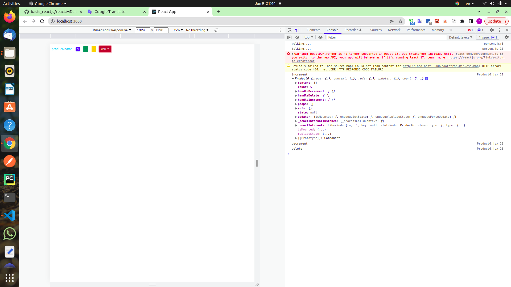

- click on buttons and console.log

## Function with parameter

```jsx
// onClick={()=>this.handleDelete(55)}
<button
  onClick={() => this.handleDelete(55)}
  className="m-2 btn btn-sm btn-danger"
>
  delete
</button>;

handleDelete = (itemNumber) => {
  console.log("itemNumber");
};
```

# state

## Install Extension

## install React developer tools

inspect/components <br>
componentname state

## state

src/components/product7.jsx

```jsx
 state = {
    count: 0,
    productName:'laptop'
  }

<span className='m-2 text-info'>{this.state.productName}</span>
<button onClick={this.handleIncrement } className='m-2 btn btn-sm btn-success'>+</button>

handleIncrement = () => {
    // const count = this.state.count;
    const { count } = this.state;
    // this.setState({ count: this.state.count + 1 })
    this.setState({count: count + 1})

    console.log(this.state);
  }

```

## console.log(this.state);

```jsx
inspect/click on + button <br>
{count: 0, productName: 'laptop'}
count: 0
productName: "laptop"
```

## install React developer tools

inspect/components <br>
componentname state

## funtional Component

```jsx
// javascript(for useState)
const result = ['one','two']
const one = result [0]
cosnt two = result [1]
cosnt [first,second] = result;
first
out => 'one'
second
out => 'two'
```

```jsx
src / component / functional;
import React, { useState } from "react";
const [count, setCount] = useState(0);
const handleIncrement = () => {
  setCount(count + 1);
};
<button onClick={handleIncrement} className="m-2 btn btn-sm btn-success">
  +
</button>;
```

## point

## Function outside the component

```jsx
src / component / functional;
import React, { useState } from "react";
// handleDecrement out  of component
const handleDecrement = (count, setCount) => {
  setCount(count - 1);
};

const Product = () => {
  const [count, setCount] = useState(0);

  return (
    <div>
      <button
        onClick={() => handleDecrement(count, setCount)}
        className="m-2 btn btn-sm btn-warning"
      >
        -
      </button>
    </div>
  );
};

export default Product;
```

‍‍‍‍‍‍‍‍‍‍

## A tree(Products) that has three components inside

- The point is that each component has its own state

```jsx
src / components / Products;
// imrc
import React, { Component } from "react";
import Product7 from "./Product7";
// cc
class Products extends Component {
  state = {};
  render() {
    return (
      <div>
        <Product7 />
        <Product7 />
        <Product7 />
      </div>
    );
  }
}

export default Products;
```

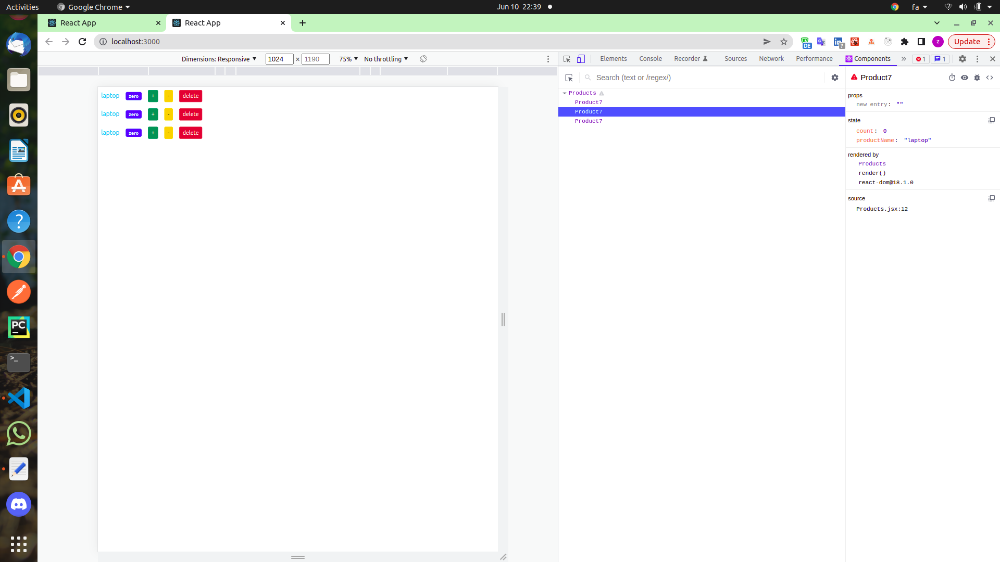

- Each product has its own name => props

## props

```jsx
src / components / Products;
// imrc
import React, { Component } from "react";
import Product7 from "./Product7";
// cc
class Products extends Component {
  state = {};
  render() {
    return (
      <div>
        <Product7 productName="laptop" />
        <Product7 productName="phone" />
        <Product7 productName="airpod" />
      </div>
    );
  }
}

export default Products;
```

```jsx
src / Product7.jsx;
import React, { Component } from "react";

class Product7 extends Component {
  state = {
    count: 0,
  };
  render() {
    // props
    const { productName } = this.props;
    return (
      <div>
        {/* props */}
        {/* <span className='m-2 text-info'>{this.props.productName}</span>       */}
        {/* props */}
        <span className="m-2 text-info">{productName}</span>
      </div>
    );
  }
}

export default Product7;
```

## props in func

```jsx
src/components/functional/Products
<Product productName='laptop' />
src/functional/Product

// props
src/components/functional/Product
const { productName } = props;
<span className='m-2 text-info'>{productName }</span>

```

## Get data from the server( Map on an array of objects)

```jsx
src / Products;
// imrc
import React, { Component } from "react";
import Product7 from "./Product7";
// cc
class Products extends Component {
  state = {
    products: [
      { id: 1, count: 2, productName: "laptop" },
      { id: 2, count: 1, productName: "phone" },
      { id: 3, count: 4, productName: "airpod" },
    ],
  };
  render() {
    return (
      <div>
        {/* <Product7 productName='laptop' />
       <Product7 productName='phone' />
       <Product7 productName='airpod' />       */}
        {this.state.products.map((p, index) => (
          <Product7 key={index} productName={p.productName} count={p.count} />
        ))}
      </div>
    );
  }
}

export default Products;
```

- count is props

```jsx
src / Product7.jsx;
import React, { Component } from "react";

class Product7 extends Component {
  // count = 5;
  state = {
    // productName:'laptop'
    // count: 0,
    count: this.props.count,
  };

  render() {
    // props
    const { productName } = this.props;
    return (
      <div>
        {/* props */}
        {/* <span className='m-2 text-info'>{this.props.productName}</span>       */}
        {/* props */}
        <span className="m-2 text-info">{productName}</span>
        <span className="m-2 badge bg-primary">{this.format()}</span>
        <button
          onClick={this.handleIncrement}
          className="m-2 btn btn-sm btn-success"
        >
          +
        </button>
        <button
          onClick={this.handleDecrement}
          className="m-2 btn btn-sm btn-warning"
        >
          -
        </button>
        <button
          onClick={() => this.handleDelete(55)}
          className="m-2 btn btn-sm btn-danger"
        >
          delete
        </button>
      </div>
    );
  }
  handleIncrement = () => {
    // const count = this.state.count;
    const { count } = this.state;
    // this.setState({ count: this.state.count + 1 })
    this.setState({ count: count + 1 });

    console.log(this.state);
  };

  handleDecrement = () => {
    // console.log('decrement');
    const { count } = this.state;
    this.setState({ count: count - 1 });
  };
  handleDelete = (itemNumber) => {
    console.log(itemNumber);
  };

  format() {
    if (this.state.count === 0) {
      return "zero";
    } else {
      return this.state.count;
    }
  }
}

export default Product7;
```

## map on function

```jsx
src / components / functional / Products;
import React, { useState } from "react";
import Product from "./Product";

const Products = () => {
  const [products] = useState([
    { id: 1, count: 2, productName: "F_laptop" },
    { id: 2, count: 1, productName: "F_phone" },
    { id: 3, count: 4, productName: "F_airpod" },
  ]);
  return (
    <div>
      {/* <Product productName='phone' />
      <Product productName='airpod' />  */}
      {products.map((p, index) => (
        <Product key={index} productName={p.productName} count={p.count} />
      ))}
    </div>
  );
};

export default Products;
```

- count is props

```jsx
import React, { useState } from "react";

// handleDecrement out  of component
const handleDecrement = (count, setCount) => {
  setCount(count - 1);
};

const Product = (props) => {
  // props
  const { productName, count: propCount } = props;
  const [count, setCount] = useState(propCount);
  const handleIncrement = () => {
    setCount(count + 1);
  };

  const handleDelete = (itemNumber) => {
    console.log(itemNumber);
  };
  const format = () => {
    if (count === 0) {
      return "zero";
    } else {
      return count;
    }
  };
  return (
    <div>
      {/* props */}
      {/* <span className='m-2 text-info'>{props.productName}</span>  */}
      <span className="m-2 text-info">{productName}</span>

      <span className="m-2 badge bg-primary">{format()}</span>
      <button onClick={handleIncrement} className="m-2 btn btn-sm btn-success">
        +
      </button>
      {/* ()=>handleDecrement(count,setCount) */}
      <button
        onClick={() => handleDecrement(count, setCount)}
        className="m-2 btn btn-sm btn-warning"
      >
        -
      </button>
      <button
        onClick={() => handleDelete(55)}
        className="m-2 btn btn-sm btn-danger"
      >
        delete
      </button>
    </div>
  );
};

export default Product;
```

## Delete

## We create a method and pass it to the child

## step 1

```jsx
src / Products;
// imrc
import React, { Component } from "react";
import Product7 from "./Product7";
// cc
class Products extends Component {
  state = {
    products: [
      { id: 1, count: 2, productName: "C_laptop" },
      { id: 2, count: 1, productName: "C_phone" },
      { id: 3, count: 4, productName: "C_airpod" },
    ],
  };
  render() {
    return (
      <div>
        {this.state.products.map((p, index) => (
          <Product7
            onDelete={this.handelDelete}
            id={p.id}
            key={index}
            productName={p.productName}
            count={p.count}
          />
        ))}
      </div>
    );
  }
  // We create a method
  handleDelete = (productId) => {
    console.log(productId);
  };
}

export default Products;
```

## child

```jsx
src / Product7;
handleDelete = () => {
  this.props.onDelete(this.props.id);
};
```

### inspect,click on the delete button and console tab, we see the id of each product

## step 2

```jsx
src / components / Products;
{
  this.state.products.map((p, index) => (
    <Product7
      onDelete={this.handelDelete}
      id={p.id}
      key={index}
      productName={p.productName}
      count={p.count}
    />
  ));
}
// method
handleDelete = (productId) => {
  // console.log(productId);
  const newProducts = this.state.products.filter((p) => p.id !== productId);
  this.setState({ products: newProducts });
};
```

## delete on function

```jsx
src/components/functional/Products.jsx

<Product onDelete={handleDelete} id={p.id} key={index} productName={p.productName} count={p.count} />

function handleDelete(productId) {
    const newProducts = products.filter((p) => p.id !== productId);
    setProducts(newProducts);
  }

```

```jsx
// props
const { productName, count: propCount, onDelete, id } = props;

<button onClick={handleDelete} className="m-2 btn btn-sm btn-danger">
  delete
</button>;

function handleDelete() {
  onDelete(id);
}
```

## Reset

- 1.

```jsx
src/components/Products.jsx
<button onClick={this.handleReset} className='btn btn-primary'>Reset</button>

handleReset = () => {
    // console.log('handleReset');
    const newProducts = this.state.products.map(p=>{
      p.count = 0;
      return p
    });
    this.setState({products: newProducts});
  }
```

- 2.

```jsx
src/components/Product7.jsx
remove state
change format func
format(){
    if(this.props.count === 0){
      return '0';
    }else{
      return this.props.count;
    }
  }
```

## props

```jsx
create Product8
handleIncrement and handleDecrement worked with state

// Product
<Product8 onIncrement={this.handleIncrement} onDecrement={this.handleDecrement} onDelete={this.handleDelete} id={p.id} key={index} productName={p.productName} count={p.count} />


 handleIncrement = (productId) => {
    const newProducts = [...this.state.products];
    const index = newProducts.findIndex(p => p.id === productId);
    newProducts[index].count += 1;
    this.setState({products: newProducts});
  }

```

```jsx
// Product8
<button onClick={this.handleIncrement} className='m-2 btn btn-sm btn-success'>+</button>


handleIncrement = () => {
  this.props.onIncrement(this.props.id);
};
```

## function props

```jsx
//src/components/functional/ Products
<Product onIncrement={handleIncrement} onDecrement={handleDecrement} onDelete={handleDelete} id={p.id} key={index} productName={p.productName} count={p.count} />

function handleIncrement (productId) {
    const newProducts = [...products];
    const index = newProducts.findIndex(p => p.id === productId);
    newProducts[index].count += 1;
    setProducts(newProducts);
 }
```

```jsx
// Product
//props
const Product = ({productName, count, onDelete, id, onIncrement, onDecrement })=> {return()}
// + (handleIncrement)
<button onClick={handleIncrement} className='m-2 btn btn-sm btn-success'>+</button>
const handleIncrement = () => {    
    // setCount(count+1)
    onIncrement(id)
   
  }

```

## sibiling(<Navbar/>,<Products/>)
```jsx
navbar.jsx
app.jsx
index.jsx

// app.jsx
import React from 'react';
import Products from "./components/Products";
import Navbar from "./components/navbar";


// function

function App() {
  return (
    <div>
      

      <Navbar/>
      <Products/>
      
    </div>
  )
}
export default App;


```
* 1.(app.jsx)
```jsx
import React,{ Component } from "react";
import Products from "./components/Products";
import Navbar from "./components/navbar";
import ProductContext from "./context/products";

class App extends Component {

  state = {
    products: [
      { id: 1, count: 2, productName: "context_laptop" },
      { id: 2, count: 1, productName: "context_phone" },
      { id: 3, count: 4, productName: "context_airpods" },
    ],
  };

  render() {
   
    return (
      <div>
        <Navbar products={this.state.products} />
        <Products
          products={this.state.products}
          onDelete={this.handleDelete}
          onIncrement={this.handleIncrement}
          onDecrement={this.handleDecrement}
          onReset={this.handleReset}
        />
      </div>
    );
  }

  handleDelete = (productId) => {
    const newProducts = this.state.products.filter((p) => p.id !== productId);
    this.setState({ products: newProducts });
  };

  handleIncrement = (productId) => {
    const newProducts = [...this.state.products];
    const index = newProducts.findIndex((p) => p.id === productId);
    newProducts[index].count += 1;
    this.setState({ products: newProducts });
  };

  handleDecrement = (productId) => {
    const newProducts = [...this.state.products];
    const index = newProducts.findIndex((p) => p.id === productId);
    newProducts[index].count -= 1;
    this.setState({ products: newProducts });
  };

  handleReset = () => {
    const newProducts = this.state.products.map((p) => {
      p.count = 0;
      return p;
    });
    this.setState({ products: newProducts });
  };
}

export default App;

```
* 2.(src/components/navbar.jsx)
```jsx
import React, { Component } from 'react';
class Navbar extends Component {
  render() { 
    return (
      <nav className='navbar navbar-light bg-light'>
        <div className="container-fluid">
          <a href="#" className="navbar-brand">
          Navbar {this.calculateSum()}
        </a>
        </div>
      </nav>
    );
 }

   calculateSum = ()=>{
     let sum = 0;
   this.props.products.forEach(p=>{
       sum += p.count;
   })
     return sum;
  }
}
 
 export default Navbar;
```
* 3.(src/aomponents/products.jsx)
```jsx
import React, { Component } from 'react';
import Product8 from './Product8';
class Products extends Component {
  
  render() { 
    return (<div>
     
  <button onClick={this.props.onReset} className='btn btn-primary'>Reset</button>
       {this.props.products.map((p,index) => (
           <Product8 onIncrement={this.props.onIncrement} onDecrement={this.props.onDecrement} onDelete={this.props.onDelete} id={p.id} key={index} productName={p.productName} count={p.count} />
       ))}
    </div>)
  }

 }
 
 export default Products;
```

## createContext
```jsx
create context folder and produxts.js
// 1.
import { createContext } from 'react';

const productContext = createContext({
  .
  .
  .
});

export default productContext;
// 2
import { createContext } from 'react';

const productContext = createContext({
  products: [],
  onDelete: ()=>{},
  onIncrement: ()=>{},
  onDecrement: ()=>{},
  onReset: ()=>{},
});

export default productContext;

```

```jsx
app.js
<ProductContext.Provider
          value={{
            products: this.state.products,
            onDelete: this.handleDelete,
            onIncrement: this.handleIncrement,
            onDecrement: this.handleDecrement,
            onReset: this.handleReset,
          }}
        >
        <Navbar />
        <Products />
</ProductContext.Provider>
```

```jsx
navbar.jsx
import React, { Component } from 'react';
// context
import ProductContext from "./../context/products";


class Navbar extends React.Component {
  // context
  static contextType = ProductContext;

  render() { 
    return (
      <nav className='navbar navbar-light bg-light'>
        <div className="container-fluid">
          <a href="#" className="navbar-brand">
            Navbar {this.calculateSum()}
          </a>
        </div>
      </nav>
    );
  }
// context
  calculateSum = ()=>{
    let sum = 0;
    this.context.products.forEach(p=>{
      sum += p.count;
    })
    return sum;
  }
}
 
export default Navbar;
```

```jsx
products with context
product with coontext
```

# lifeCycle
## mount(constructor-render- componentDidmount)
```jsx
constructor(props){
    super(props);
   console.log('App - constructor');
   }

 componentDidMount(){
  console.log('App - didMount');
  }
```
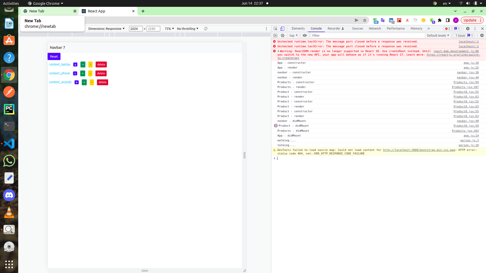

## update(change state)/(render- componentDidUpdate)
```jsx
 componentDidUpdate(){
    console.log('App - didUpdate');
  }
```

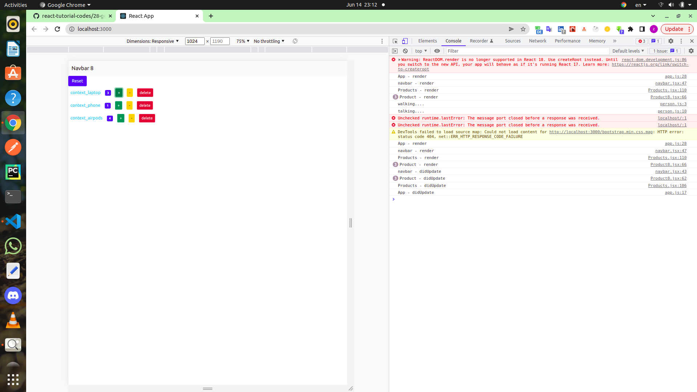

## unmount(delete component)/(componentWillUnmount)
```jsx
//product8
 componentWillUnmount(){
    console.log('Product - WillUnmount');
  }
```
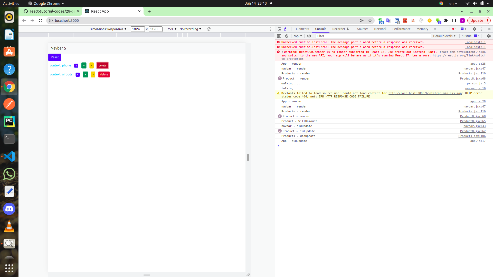

# lifeCycle(func)

* useEffect
```jsx
import React,{ useEffect } from "react";
```

## update
```jsx
// app.jsx

  useEffect(() => {
    console.log('app')
  });
```
## mount 
```jsx
// app.jsx
  useEffect(() => {
    console.log('app')
  },[]);
```

## unmount
```jsx
// product.jsx
useEffect(() => {
    return()=>{console.log('product-unmount')}
    
  },[]);
```
