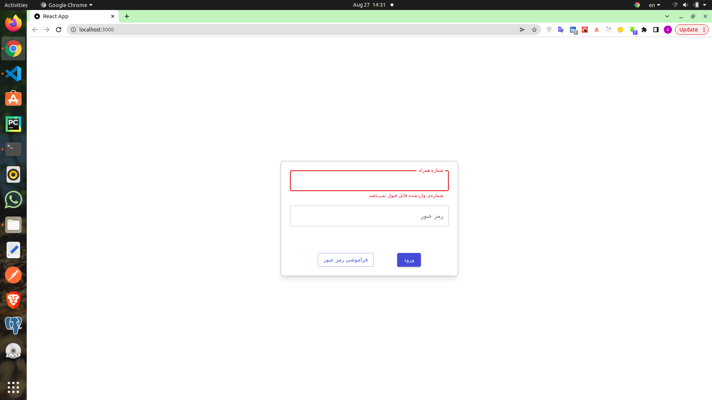

## install

### react,mui,tailwind

```bash
# react
npx create-react-app state
cd state
npm start
```

### mui

```jsx
# mui
npm install @mui/material @emotion/react @emotion/styled
npm install @mui/material @mui/styled-engine-sc styled-components
# rtl
# index.html
<html lang="fa" dir="rtl"></html>
# index.js
import { createTheme } from '@mui/material/styles';

const theme = createTheme({
  direction: 'rtl',
});
// install plugin
npm install stylis stylis-plugin-rtl
//
import rtlPlugin from 'stylis-plugin-rtl';
import { CacheProvider } from '@emotion/react';
import createCache from '@emotion/cache';
import { prefixer } from 'stylis';
// Create rtl cache
const cacheRtl = createCache({
  key: 'muirtl',
  stylisPlugins: [prefixer, rtlPlugin],
});

function RTL(props) {
  return <CacheProvider value={cacheRtl}>{props.children}</CacheProvider>;
}

const root = ReactDOM.createRoot(document.getElementById('root'));
root.render(
  <RTL>
      <ThemeProvider theme={theme}>

      <App />
      </ThemeProvider>
    </RTL>

);


```

### tailwiind

```jsx
# tailwiind
npm install -D tailwindcss postcss autoprefixer
npx tailwindcss init -p
# tailwind.config.js
/** @type {import('tailwindcss').Config} */
module.exports = {
  content: [
    "./src/**/*.{js,jsx,ts,tsx}",
  ],
  theme: {
    extend: {},
  },
  plugins: [],
}
# index.css
@tailwind base;
@tailwind components;
@tailwind utilities;
```

### input

```jsx
const [phone, setPhone] = useState("");
<TextField value={phone} onChange={(e) => setPhone(e.target.value)} />;
console.log("phone", phone);
```

```jsx
function App() {
  // state
  const [phone, setPhone] = useState("");
  const [password, setPassword] = useState("");

  return (
    <div className="w-full h-full flex justify-center items-center ">
      <div className="flex flex-col shadow-lg self-center my-4 gap-4 basis-[30rem] min-h-40 p-6 border-2 border-solid border-stone-300 rounded-lg">
        <TextField
          fullWidth
          label="شماره همراه"
          value={phone}
          onChange={(e) => setPhone(e.target.value)}
        />
        <TextField
          type="password"
          fullWidth
          label="رمز عبور"
          value={password}
          onChange={(e) => setPassword(e.target.value)}
        />
        <div className="flex justify-between md:justify-around w-[95%] md:w-[80%] self-center text-sm mt-14">
          <Button
            variant="contained"
            // disabled={error || phone.length === 0 || password.length === 0}
            // onClick={submit}
          >
            ورود{" "}
          </Button>
          <Button
            variant="outlined"
            className="rounded-lg bg-white p-2"
            // onClick={() => router.push("/auth/forget-password")}
          >
            فراموشی رمز عبور{" "}
          </Button>
        </div>
      </div>
    </div>
  );
}

export default App;
```

## error

1. state for value of error

```jsx
// error
const [error, setError] = useState("");
<TextField error={error} helperText={error} />;
```

2.when sholud be update error?when phone changed update state

```jsx
// useEffect
useEffect(() => {}, [phone, setError]);
```

3.how to reconize you have error?phone test with regex

```jsx
if (/^09[0-9]{9}$/g.test(phone)) {
  console.log("no error");
  setError("");
} else {
  console.log("error");
  setError("شماره‌ی واردشده قابل قبول نمی‌باشد.");
}
```

```jsx
import { Button, TextField } from "@mui/material";
import { useEffect, useState } from "react";

function App() {
  // state
  const [phone, setPhone] = useState("");
  const [password, setPassword] = useState("");
  // error
  const [error, setError] = useState("");
  // useEffect
  useEffect(() => {
    // const regex = ;
    // console.log("error", /^09[0-9]{9}$/g.test(phone))
    if (/^09[0-9]{9}$/g.test(phone)) {
      console.log("no error");
      setError("");
    } else {
      console.log("error");
      setError("شماره‌ی واردشده قابل قبول نمی‌باشد.");
    }
  }, [phone, setError]);
  return (
    <div className="w-full h-full flex justify-center items-center ">
      <div className="flex flex-col shadow-lg self-center my-4 gap-4 basis-[30rem] min-h-40 p-6 border-2 border-solid border-stone-300 rounded-lg">
        <TextField
          fullWidth
          label="شماره همراه"
          value={phone}
          onChange={(e) => setPhone(e.target.value)}
          error={error}
          helperText={error}
          inputProps={{ style: { textAlign: "center" } }}
        />
        <TextField
          type="password"
          fullWidth
          label="رمز عبور"
          value={password}
          onChange={(e) => setPassword(e.target.value)}
        />
        <div className="flex justify-between md:justify-around w-[95%] md:w-[80%] self-center text-sm mt-14">
          <Button
            variant="contained"
            // disabled={error || phone.length === 0 || password.length === 0}
            // onClick={submit}
          >
            ورود{" "}
          </Button>
          <Button
            variant="outlined"
            className="rounded-lg bg-white p-2"
            // onClick={() => router.push("/auth/forget-password")}
          >
            فراموشی رمز عبور{" "}
          </Button>
        </div>
      </div>
    </div>
  );
}

export default App;
```

when there is no input but you seen errors


### solution

```jsx
useEffect(() => {
  if (phone.length == 0 || /^09[0-9]{9}$/g.test(phone)) {
    setError("");
  } else {
    setError("شماره‌ی واردشده قابل قبول نمی‌باشد.");
  }
}, [phone, setError]);
```

### improve error

1.useEffect twice update state
2.when there is no input but you seen errors

```jsx
// dec func
const updatePhone = (value) => {
  if (/^09[0-9]{9}$/g.test(value)) {
    console.log("no error");
    setError("");
  } else {
    console.log("error");
    setError("شماره‌ی واردشده قابل قبول نمی‌باشد.");
  }
  setPhone(value);
};
// textfield
<TextField onChange={(e) => updatePhone(e.target.value)} />;
```

```jsx
import { Button, TextField } from "@mui/material";
import { useEffect, useState } from "react";

function App() {
  // state
  const [phone, setPhone] = useState("");
  const [password, setPassword] = useState("");
  // error
  const [error, setError] = useState("");

  // custom set function
  const updatePhone = (value) => {
    if (/^09[0-9]{9}$/g.test(value)) {
      console.log("no error");
      setError("");
    } else {
      console.log("error");
      setError("شماره‌ی واردشده قابل قبول نمی‌باشد.");
    }
    setPhone(value);
  };
  return (
    <div className="w-full h-full flex justify-center items-center ">
      <div className="flex flex-col shadow-lg self-center my-4 gap-4 basis-[30rem] min-h-40 p-6 border-2 border-solid border-stone-300 rounded-lg">
        <TextField
          fullWidth
          label="شماره همراه"
          value={phone}
          onChange={(e) => updatePhone(e.target.value)}
          error={error}
          helperText={error}
          inputProps={{ style: { textAlign: "center" } }}
        />
        <TextField
          type="password"
          fullWidth
          label="رمز عبور"
          value={password}
          onChange={(e) => setPassword(e.target.value)}
        />
        <div className="flex justify-between md:justify-around w-[95%] md:w-[80%] self-center text-sm mt-14">
          <Button
            variant="contained"
            // disabled={error || phone.length === 0 || password.length === 0}
            // onClick={submit}
          >
            ورود{" "}
          </Button>
          <Button
            variant="outlined"
            className="rounded-lg bg-white p-2"
            // onClick={() => router.push("/auth/forget-password")}
          >
            فراموشی رمز عبور{" "}
          </Button>
        </div>
      </div>
    </div>
  );
}

export default App;
```

### useMemo

you dont have state

```jsx
const error = useMemo(() => {
    if (/^09[0-9]{9}$/g.test(phone)) {
      return ""
    }
    else {
     return("شماره‌ی واردشده قابل قبول نمی‌باشد.");
    }

  },[phone])
  <TextField

   value={phone}
   onChange={(e) => setPhone(e.target.value)}
   error={error}
   helperText={error}

        />
```

```jsx
import { Button, TextField } from "@mui/material";
import { useEffect, useMemo, useState } from "react";

function App() {
  // state
  const [phone, setPhone] = useState("");
  const [password, setPassword] = useState("");
  const error = useMemo(() => {
    if (/^09[0-9]{9}$/g.test(phone)) {
      return "";
    } else {
      return "شماره‌ی واردشده قابل قبول نمی‌باشد.";
    }
  }, [phone]);

  return (
    <div className="w-full h-full flex justify-center items-center ">
      <div className="flex flex-col shadow-lg self-center my-4 gap-4 basis-[30rem] min-h-40 p-6 border-2 border-solid border-stone-300 rounded-lg">
        <TextField
          fullWidth
          label="شماره همراه"
          value={phone}
          onChange={(e) => setPhone(e.target.value)}
          error={error}
          helperText={error}
          inputProps={{ style: { textAlign: "center" } }}
        />
        <TextField
          type="password"
          fullWidth
          label="رمز عبور"
          value={password}
          onChange={(e) => setPassword(e.target.value)}
        />
        <div className="flex justify-between md:justify-around w-[95%] md:w-[80%] self-center text-sm mt-14">
          <Button
            variant="contained"
            // disabled={error || phone.length === 0 || password.length === 0}
            // onClick={submit}
          >
            ورود{" "}
          </Button>
          <Button
            variant="outlined"
            className="rounded-lg bg-white p-2"
            // onClick={() => router.push("/auth/forget-password")}
          >
            فراموشی رمز عبور{" "}
          </Button>
        </div>
      </div>
    </div>
  );
}

export default App;
```

when there is no input but you seen errors


### solution

```jsx
// phone.length ==0 ||
const error = useMemo(() => {
  if (phone.length == 0 || /^09[0-9]{9}$/g.test(phone)) {
    return "";
  } else {
    return "شماره‌ی واردشده قابل قبول نمی‌باشد.";
  }
}, [phone]);
```

## style point

how to center input text?

```jsx
// inputProps
<TextField inputProps={{ style: { textAlign: "center" } }} />
```
