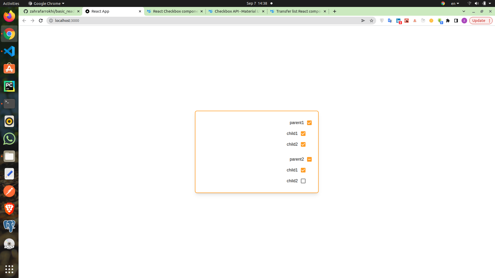
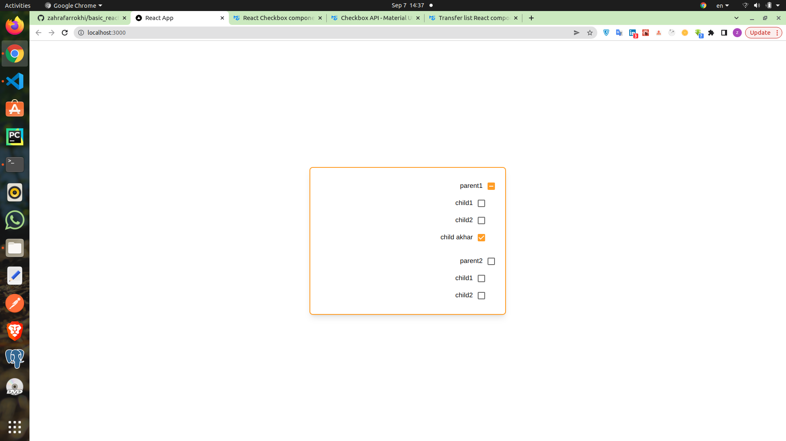

#### checkbox

```jsx
//state
const [checked, setChecked] = useState(false);
<Checkbox
  checked={checked}
  onChange={(e) => setChecked(e.target.checked)}
  inputProps={{ "aria-label": "controlled" }}
/>;
```

### multiple checkboxes

```jsx
 // state
  const [totalchecked, setChecked] = useState({
    check:false,heart:false,book:true
  }

  );

<Checkbox
  checked={totalchecked.check}
  onChange={(e)=>setChecked({ ...totalchecked, check: e.target.checked })}

/>
<Checkbox
    checked={totalchecked.heart}
    onChange={(e)=>setChecked({ ...totalchecked, heart: e.target.checked })}
  icon={<FavoriteBorder />} checkedIcon={<Favorite />} />
<Checkbox
  checked={totalchecked.book}
  onChange={(e)=>setChecked({ ...totalchecked, book: e.target.checked })}
  icon={<BookmarkBorder />}
  checkedIcon={<Bookmark />}
/>
```
## code
```jsx
import {
  Bookmark,
  BookmarkBorder,
  Favorite,
  FavoriteBorder,
} from "@mui/icons-material";
import { Button, Checkbox, IconButton, TextField } from "@mui/material";
import { useEffect, useMemo, useRef, useState } from "react";

function App() {
  // state
  const [totalchecked, setChecked] = useState({
    check: false,
    heart: false,
    book: true,
  });
  return (
    <div className="w-full h-full flex justify-center items-center ">
      <div className="flex flex-col shadow-lg self-center items-start my-4 gap-4 basis-[30rem] min-h-40 p-6 border-2 border-solid border-primary rounded-lg">
        <Checkbox
          checked={totalchecked.check}
          onChange={(e) =>
            setChecked({ ...totalchecked, check: e.target.checked })
          }
          inputProps={{ "aria-label": "controlled" }}
        />
        <Checkbox
          checked={totalchecked.heart}
          onChange={(e) =>
            setChecked({ ...totalchecked, heart: e.target.checked })
          }
          icon={<FavoriteBorder />}
          checkedIcon={<Favorite />}
        />
        <Checkbox
          checked={totalchecked.book}
          onChange={(e) =>
            setChecked({ ...totalchecked, book: e.target.checked })
          }
          icon={<BookmarkBorder />}
          checkedIcon={<Bookmark />}
        />
        <FormControlLabel control={<Checkbox defaultChecked />} label="Label" />

      </div>
    </div>
  );
}

export default App;
```
### Indeterminate checkbox

```jsx
//state
  const [totalchecked, setChecked] = useState({
    child1:false,child2:false,book:true
  }
   
  );
//children
  const children = (
    <Box sx={{ display: 'flex', flexDirection: 'column', ml: 3 }}>
      <FormControlLabel
        label="Child 1"
        control={<Checkbox checked={totalchecked.child1}  onChange={(e) =>
          setChecked({ ...totalchecked, child1: e.target.checked })
        } />}
      />
      <FormControlLabel
        label="Child 2"
        control={<Checkbox checked={totalchecked.child2}  onChange={(e) =>
          setChecked({ ...totalchecked, child2: e.target.checked })
        } />}
      />
    </Box>)
//parent

    <div>
      <FormControlLabel
        label="Parent"
        control={
          <Checkbox
            checked={totalchecked.child1 && totalchecked.child2}
            indeterminate={totalchecked.child1  !== totalchecked.child2}
            onChange={(e) =>
              setChecked({ ...totalchecked, child1: e.target.checked, child2: e.target.checked })
            } />
        }
      />
      {children}
    </div>
```
```jsx
import { Button, Checkbox, FormControlLabel, Box } from "@mui/material";
import { useEffect, useMemo, useRef, useState } from "react";


function App() {
  // state
  const [totalchecked, setChecked] = useState({
    child1:false,child2:false,book:true
  }
   
  );

  const children = (
    <Box sx={{ display: 'flex', flexDirection: 'column', ml: 3 }}>
      <FormControlLabel
        label="Child 1"
        control={<Checkbox checked={totalchecked.child1}  onChange={(e) =>
          setChecked({ ...totalchecked, child1: e.target.checked })
        } />}
      />
      <FormControlLabel
        label="Child 2"
        control={<Checkbox checked={totalchecked.child2}  onChange={(e) =>
          setChecked({ ...totalchecked, child2: e.target.checked })
        } />}
      />
    </Box>
  );

  return (
    <div className="w-full h-full flex justify-center items-center ">
      <div className="flex flex-col shadow-lg self-center items-start my-4 gap-4 basis-[30rem] min-h-40 p-6 border-2 border-solid border-primary rounded-lg">


    <div>
      <FormControlLabel
        label="Parent"
        control={
          <Checkbox
            checked={totalchecked.child1 && totalchecked.child2}
            indeterminate={totalchecked.child1  !== totalchecked.child2}
            onChange={(e) =>
              setChecked({ ...totalchecked, child1: e.target.checked, child2: e.target.checked })
            } />
        }
      />
      {children}
    </div>


      </div>
    </div>
  );
}

export default App;

```

### multi Indeterminate checkbox
```jsx
import { Button, Checkbox, FormControlLabel, Box } from "@mui/material";
import { useEffect, useMemo, useRef, useState } from "react";


function App() {
  // state
  const [totalchecked, setChecked] = useState({
    ch01:false,ch02:false,ch03:false,ch04:false, 
  }
   
  );
  const CheckboxList = [
    {
      name: 'parent1',
      children: [
        {
          id: 'ch01',
          name:'child1'

        },
        {
          id: 'ch02',
          name:'child2'
        },
      ]
    },
    {
      name: 'parent2',
      children: [
        {
          id: 'ch03',
          name:'child1'

        },
        {
          id: 'ch04',
          name:'child2'
        },
      ]
  },
]


  return (
    <div className="w-full h-full flex justify-center items-center ">
      <div className="flex flex-col shadow-lg self-center items-start my-4 gap-4 basis-[30rem] min-h-40 p-6 border-2 border-solid border-primary rounded-lg">


{/* first for: check => name, children: [(id, name), ...] */}
  {CheckboxList.map((check)=>  <div>
      <FormControlLabel
      // name of parent
        label={check.name}
        control={
          <Checkbox
            //chidren => {name,id } and totalchecked =>{ch01:t,ch02:f...}
           
            //totalchecked[c.id] = totalchecked['ch01'] or totalchecked.ch01 = false
            checked={check.children.map((c) => totalchecked[c.id]).reduce((prev, cur) => prev && cur, true)}
            //filter or reduce
             // checked={check.children.map((c)=>totalchecked[c.id]).filter(c=>c==false).length == 0}

            // At least one child is checked
         
            indeterminate={check.children.map((c) => totalchecked[c.id]).reduce((prev, cur) => prev || cur, false) && check.children.map((c)=>totalchecked[c.id]).filter(c=>c==false).length !== 0}
               // checked={check.children.map((c)=>totalchecked[c.id]).filter(c=>c==true).length > 0  && check.children.map((c)=>totalchecked[c.id]).filter(c=>c==false).length !== 0}

            onChange={(e) => {
              let newchecked = { ...totalchecked, };

              for (let ch of check.children) {
                newchecked[ch.id] = e.target.checked
              }
    
              setChecked(newchecked)
            }} />
        }
      />
      {/*second for ,child => name ,id */}
    <Box sx={{ display: 'flex', flexDirection: 'column', ml: 3 }}>
      {check.children.map((child)=>
        <FormControlLabel
        label={child.name}
        control={
          <Checkbox
            checked={totalchecked[child.id]}
            onChange={(e) =>
              setChecked({ ...totalchecked, [child.id]:e.target.checked })
            } />
        }
      />)
      }
      </Box >
    </div>

)}

      

      </div>
    </div>
  );
}

export default App;

```



### add onother checkbox
```jsx
const [totalchecked, setChecked] = useState({
    ..., ch05: false,
  }
   
  );
  const CheckboxList = [
    {
      name: 'parent1',
      children: [
        ...
        {
          id: 'ch05',
          name:'child akhar'
        },
      ]
    },
...
]

```
```jsx
import { Button, Checkbox, FormControlLabel, Box } from "@mui/material";
import { useEffect, useMemo, useRef, useState } from "react";


function App() {
  // state
  const [totalchecked, setChecked] = useState({
    ch01:false,ch02:false,ch03:false,ch04:false, ch05: false,
  }
   
  );
  const CheckboxList = [
    {
      name: 'parent1',
      children: [
        {
          id: 'ch01',
          name:'child1'

        },
        {
          id: 'ch02',
          name:'child2'
        },
        {
          id: 'ch05',
          name:'child akhar'
        },
      ]
    },
    {
      name: 'parent2',
      children: [
        {
          id: 'ch03',
          name:'child1'

        },
        {
          id: 'ch04',
          name:'child2'
        },
      ]
  },
]


  return (
    <div className="w-full h-full flex justify-center items-center ">
      <div className="flex flex-col shadow-lg self-center items-start my-4 gap-4 basis-[30rem] min-h-40 p-6 border-2 border-solid border-primary rounded-lg">


  {CheckboxList.map((check)=>  <div>
      <FormControlLabel
        label={check.name}
        control={
          <Checkbox
            //chidren => {name,id } and totalchecked =>{ch01:t,ch02:f...}
            // checked={check.children.map((c)=>totalchecked[c.id]).filter(c=>c==false).length == 0}
            checked={check.children.map((c) => totalchecked[c.id]).reduce((prev, cur) => prev && cur, true)}
            // At least one child is checked
            // checked={check.children.map((c)=>totalchecked[c.id]).filter(c=>c==true).length > 0  && check.children.map((c)=>totalchecked[c.id]).filter(c=>c==false).length !== 0}
            indeterminate={check.children.map((c) => totalchecked[c.id]).reduce((prev, cur) => prev || cur, false) && check.children.map((c)=>totalchecked[c.id]).filter(c=>c==false).length !== 0}
            onChange={(e) => {
              let newchecked = { ...totalchecked, };

              for (let ch of check.children) {
                newchecked[ch.id] = e.target.checked
              }
    
              setChecked(newchecked)
            }} />
        }
      />
    <Box sx={{ display: 'flex', flexDirection: 'column', ml: 3 }}>
      {check.children.map((child)=>
        <FormControlLabel
        label={child.name}
        control={
          <Checkbox
            checked={totalchecked[child.id]}
            onChange={(e) =>
              setChecked({ ...totalchecked, [child.id]:e.target.checked })
            } />
        }
      />)
      }
      </Box >
    </div>

)}

      

      </div>
    </div>
  );
}

export default App;


```

